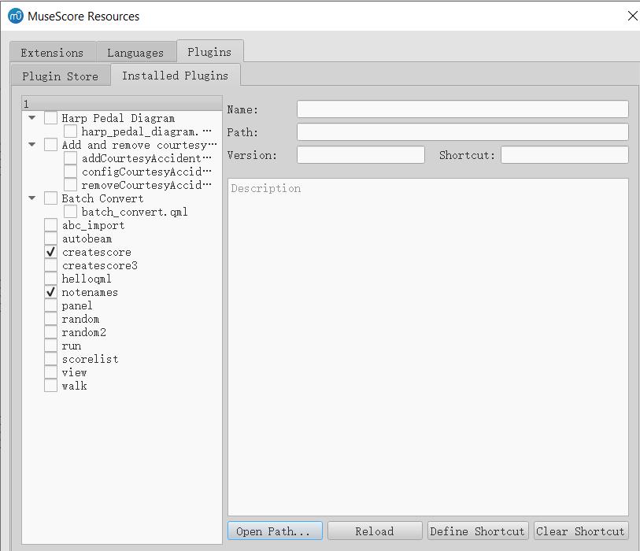

This chapter explains the overall design and usage. Intended readers are **MuseScore users and developers**.

See [here](Implementation.md) for the implementation part.

See [here](README.md) for all documents related to this project.

The new plugin store and original facilities from the old plugin manager, could both reside in “Resource Manager” in MuseScore, and in their own subtabs.

## Part I: Plugin Store

**Possible features:**

- When the resource manager shows, or the user switches to the plugin store tab, all 3.x-compatible plugins from the online plugin repository should be displayed in this table.

  > But maybe as an advanced mode, the user could force the manager to display 2.x plugin packages and download them as usual. The manager may try to convert them afterward. (The converting method is described in "Implementation" part.)

- You could search for new plugin packages and filter them by category labels.

- You could (un)install new plugin packages simply by clicking the corresponding button.

- The manager should be able to check whether each package has been installed, and display "Install" or "Uninstall" buttons according to the info.

  > However, if qml files of one particular plugin package are installed by one user manually(i.e., not from the manager), the manager wouldn‘t recognize them as part of this package, because the names of qml files are known only if that plugin package is downloaded. Therefore, one plugin package may still be marked as "Uninstalled" even if qml files of that plugin package exist locally.
  >
  > To address this problem and prevent duplicated qml files, the following feature is proposed.

- After one plugin archive is downloaded, and before files in the archive are extracted and copied, the manager will check if there exist local qml files that have the same name with the ones in the archive, and if yes, offer following options:

  - use the original file as part of this plugin, and ignore the file in the archive

  - use the file in the archive as part of this plugin, and delete the original file

  - use the file in the archive as part of this plugin, but also reserve the original file

  - abort installing

- For installed plugin packages, an "Update" button will appear. The manager should check whether they are up-to-date regularly in the background, and enable the "Update" button for each package when an update is available.

- For each installed plugin package, check whether the package is broken (i.e., missing some qml files) and offer the option to reinstall.

## Part II: Improvements in facilities of local plugins management

**Possible features:**

- To keep backward compatibility, you could still manually download the qml file yourself or write your own plugin qmls locally, and copy them to plugin directory. Then they will appear after reloading.

- If local plugins are checked to be incompatible, necessary prompts are nice to be added.

  > Maybe as an advanced mode, the manager could offer the attempt to convert 2.x plugins to 3.x ones. (The converting method is described in "Implementation" part)

- All other facilities of the old plugin manager, including:

  - enabling/disabling each qml.

  - shortcut configuration.

  - displaying the name, path, version, and description. 

- The list in the left should display both plugins installed from store and manually installed plugins. However, there are several choices of displaying them:

  - As before, show all existing qml files, including those from the store, in a flattened form.

  - Show each plugin package as an item and hide all qml files it has.

  - (Reflected in the UI image) Use a tree view, and show each plugin package as the branch, and its qml files as leaves under that branch. Show manually installed qml files as branches with the same hierarchy level as plugin packages.

  The last choice is the most flexible and is currently my choice.