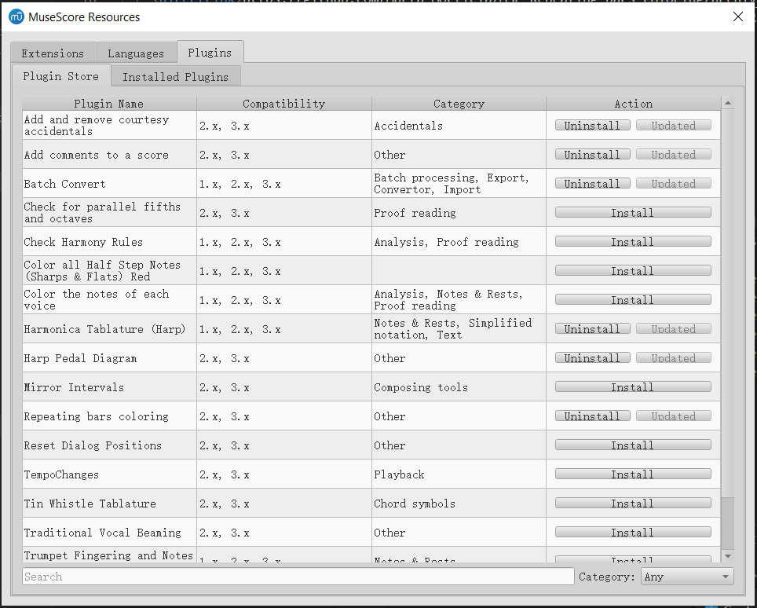
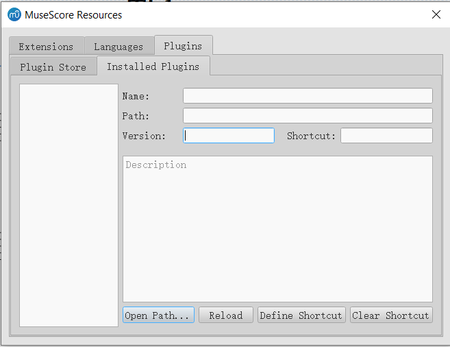

# Proposal of App Store-like Plugin Manager

By songchaow.

## Overview of Design

A new app-store like Plugin Manager is planned to be implemented. This tool can reside in Resource Manager(find it in MuseScore menu: Preferences->General->Update translations, or Help->Resource Manager) as a new tab, or just replace the old plugin manager.

In short, two main facilities are covered:

- (Part I) Automatically install and manage plugin packages from [MuseScore plugin repository](https://musescore.org/en/plugins).
- (Part II) Traditional facilities for local installed plugins(some of those plugins may be not published online).

> Here I refer to the stuff you download from the plugin repository as a "**plugin package**". 
>
> I want to stress the difference between a plugin package and a qml file, since **one** plugin package(such as [this one](https://musescore.org/project/add-and-remove-courtesy-accidentals)) may contain **multiple** qml files.
>
> In light of this, one qml plugin can have two meaningful names: the first is base name of the qml file(corresponding to one particular item in MuseScore Plugin's drop-down menu), and the second is the title from the web plugin page, i.e., the name of corresponding plugin package.

### Part I

UI demo from [a basic implementation](https://github.com/musescore/MuseScore/pull/4833).



All 3.x-compatible plugins from the online plugin repository should be displayed in this table. 

> But maybe as an advanced mode, users can force the manager to display 2.x plugin packages and ask the manager to convert them to 3.x. (The converting method is described in "Implementation" part.)

**Possible features:**

- you can search for new plugin packages and filter them by category labels.

- you can download new plugin packages and install them simply by clicking the "Install" button.

- The manager should be able to check whether each package has been installed, and display "Install" or "Uninstall" buttons according to the info.

  However, if qml files of one particular plugin package are installed by one user manually(i.e., not from the manager), the manager wouldn‘t recognize them as part of this package, because the names of qml files can only be known after that plugin package is downloaded. Therefore, one plugin package may still be marked as "Uninstalled" even if qml files of that plugin package exist.

  To address this problem and prevent duplicated qml files, the following feature is proposed.

- after one plugin archive is downloaded, the manager will check if there exist qml files that have the same name with the ones in the archive, and if yes, offer the options to replace existing files, abort installing or duplicate the files.

- Since some plugin packages may contain both 2.x and 3.x qml files in one single archive(such as [this one](https://github.com/Marta-Morticia/MSP-Repeating-bars-coloring)), it would be nice to let the user select what qml files are needed to reserve and discard those unwanted qml files before installing them to MuseScore's plugin directory.

- For installed plugin packages, an "Update" button will appear disabled. The manager should check whether they are up-to-date regularly in the background. And enable the "Update" button for each package when an update is available.

- For installed plugin packages, you can enable, disable or uninstall them by clicking corresponding buttons.

  > These operation applies to all qmls that belong to the plugin package. 
  >
  > In Part II, there are operations that apply to one single qml.

### Part II

Conceptual UI demo I made by merely modifying the UI file:



All installed plugins, at least for qmls that you manually added, will be displayed in the left QListWidget.

The text of each item in QListWidget is currently base name of the qml file.

**Possible features:**

- In addition to using Part I's facility, you can still manually download the qml file yourself or write your own plugin qmls locally, and copy them to plugin directory. Then they will appear after reloading.

- If local plugins are checked to be incompatible, necessary prompts can be added. 

  Maybe as an advanced mode, the manager can offer the attempt to convert 2.x plugins to 3.x ones. (The converting method is described in "Implementation" part)

- The traditional plugin manager's facilities will be reserved in this tab, including:

  - enabling/disabling each qml
  - shortcut configuration
  - displaying name, path, version and description. 

  These facilities are arranged as before in the right panel.

  <!--As to display of plugin name among these, I recommend **using name from title from plugin page(that's the name of plugin package)**, **rather than the base name of qml file**, as the base name is already shown in the left QListWidget. What's more, in this way we can tell difference between local plugins() and plugins from repository.-->

- For plugin packages installed from repository, there're several choices for displaying:

  - Just don't display them in this tab. Let users manage them completely in the first tab(Part I).

    Then facilities like shortcut configuration are lost.

  - One plugin package corresponds to one item in the left QListWidget.

  - Like local plugins, one plugin qml corresponds to one item in the left QListWidget.

  Personally I prefer the third choice, as it's flexible for users and relative simpler to implement than the second choice.

  But the second choice is also considerable if we implement a tree view, displaying all qmls of one package under that package item.

### Miscellaneous

- some blocking methods(`displayingLanguages` and `displayExtensions`) are called in Resource Manager's constructor. So Resource Manager will not open before download completes, which could be a rather long process. To solve this, we can move the blocking methods in a separate thread.

- To make things consistent, Add "Check for new version of MuseScore plugins" in MuseScore->Preferences -> Update.

  And add corresponding facility of update reminder.

  

## Implementation

### Fetching from Web

When we launch the resource manager, the crawler should fetch a list of available plugin packages from `https://musescore.org/en/plugins?category=All&compatibility=some_version_id`.

The map between MuseScore version and`some_version_id` is:

| MuseScore Version | `some_version_id` |
| ----------------- | ----------------- |
| 1.x               | 4311              |
| 2.x               | 4316              |
| 3.x               | 4321              |

> It's not hard to parse the raw HTML table using some libraries, though the parsing code would be simpler if there were a JSON file.

Only 3.x plugin packages are fetched by default.

Each entry of the plugin list should contain:

- Title(string)

  > The title here should use the title from the plugin page, i.e., the name of plugin package.

- API Compatibility(a tuple of `bool` indicating compatibilities for 3 versions)

- URL of the plugin page(string)

- Categories(`vector` of enum object)

The class `PluginPackageMeta` in the [draft implementation](<https://github.com/musescore/MuseScore/blob/96196532ca68ca6ded2f009ac9c2da0113b891b1/mscore/plugin/pluginManager.h#L33>) reflects this structure.

### Download

Then when we click on `Install` button of any entry of plugin, the crawler will fetch the plugin page.

If GitHub repo links are found in the page HTML, [Github Release APIs](https://developer.github.com/v3/repos/releases) should be used to further fetch the package info.

Else, look for direct links in the page or the attachments.

Finally, structured description of this package will be recorded, including:

- GitHub repo URL(if applicable).
- URLs that are recognized to be downloadable links for proper plugin archives or qml file.
- latest commit hash of of corresponding branch on GitHub if applicable, this field is used for checking updates.
- latest release ID of GitHub releases if applicable, this field is used for checking updates, this field is used for checking updates.

The class `PluginPackageDescription` in the [draft implementation](<https://github.com/musescore/MuseScore/blob/96196532ca68ca6ded2f009ac9c2da0113b891b1/mscore/plugin/pluginManager.h#L54>) reflects this structure.

> This fetch procedure can also be considered to run automagically in the background, as the total number of plugins is not huge.

**These steps would require sophisticated pattern recognizing algorithms to choose download links of the correct version(2.x or 3.x, etc. ), which can be further discussed and optimized later.**

When downloading files from musescore.org,  `Last Modified` field from the HTTP response should also be added to the description of the package, this field is used for checking updates.

### Extract and Install

#### Determining the file extension name

First we need to check whether we've downloaded a qml file or an archive.

If the file is downloaded from GitHub, we will always get an archive of that repository. If from musescore.com, the extension can always be checked in the suffix of the direct link.

The manager should extract the downloaded file if it's an archive, or directly install if it's a qml file.

#### Get file list and determine files to be reserved

> There are [some code snippets](https://github.com/musescore/MuseScore/blob/1d5ae8afbb4b83b36558c1e365e8794d170d5065/mscore/resourceManager.cpp#L291) used for unzipping language packages, which can be used similarly for plugin packages.

Before the archive is extracted, we can use `MQZipReader` in MuseScore to read a file list contained in the archive.

Following filetypes are necessary to be reserved:

- Plugin files(*.qml)
- Translation related files(*.qm and *.ts)

The file list should be scanned for these filetypes.

Then if multiple qml files are found, especially for those that have similar name base(like `color_rep_2x.qml` and `color_rep_3x.qml`), the manager prompts the user to select the qml files they want via a dialog.

#### Check duplicated qml files

The chosen qml files are then compared against each plugin in the `_pluginList` variable in class `PluginManager`. If a file with the same name is found, ask the user for actions as described in "Design Overview Part I".

#### Extract files selected and copy to plugin directory

Finally, the qml files and translation files are copied into a new folder under MuseScore plugin directory. The name of the new folder can be the last URL slug of the plugin page URL. For example: `tunings-and-temperaments` for `https://musescore.org/en/project/tunings-and-temperaments`.

### Maintaining Local Plugins and Plugin Packages

#### Permanent Storage

Currently, MuseScore stores metadata for local plugins in `plugins.xml`(located in C:\\[your username]\AppData\Local\MuseScore\MuseScore3). The xml file only stores the qml file path and flag of whether loaded for each local plugin. After MuseScore is launched, these items will be read into `QList<PluginDescription> _pluginList` in class `PluginManager`. (See [here](https://github.com/musescore/MuseScore/blob/a9df4a02c07cf5666644be620c6b951becedade8/mscore/plugin/pluginManager.cpp#L67))

Qml files of plugin **packages** should also be added into `plugins.xml`. Those matters are taken good care of in traditional plugin related codes and don't need modification.

But beyond these, for each plugin package downloaded from repository, additional metadata should be maintained. Essentially, all members in `PluginPackageDescription`, plus the plugin page URL, should be serialized and stored.

- The plugin page URL is needed because the URL is helpful to identify installed plugin package from the plugin list fetched from repository. (We cannot tell that merely from installed qml files.)

- Other members in `PluginPackageDescription` are stored mainly for checking updates. See the section "Automatic Update".

These metadata can be saved in a separate xml file(currently saved as `pluginpackages.xml` in the same directory as `plugins.xml` in the [draft implementation](<https://github.com/musescore/MuseScore/blob/cdc3b74c0c057e4d7be3055452d1e3e7d91bf9c2/mscore/resourceManager.cpp#L682>)).

#### Runtime Data Structure

Currently MuseScore uses `QList<PluginDescription> PluginManager::_pluginList` to maintain local plugins. When MuseScore launches, it fills this QList with contents from `plugins.xml`, and loads and registers plugins that are marked to load.

For plugin packages, following classes are added:

```c++
struct PluginPackageMeta;
enum PluginPackageSource;
struct PluginPackageDescription;
```

The classes `PluginPackageMeta` and `PluginPackageDescription` are described above. And `PluginPackageSource` is just an enum specifying the source is GitHub, GitHub release or attachment.

And there need to be a new `QMap<QString, PluginPackageDescription>` to maintain installed plugin packages, which maps a plugin page url to the description of that package. It is read from `pluginpackages.xml` when the resource manager starts.

integrities of each `PluginPackage` are checked by verifying existence of each qml file.

### Compatibility Check

Each plugin has its API compatibility specified in its web page. Plugins of compatibility 1.x, 2.x and 3.x can only be run on MuseScore 1.x, 2.x and 3.x respectively.

Compatibility check should happen in two cases:

- When installing plugins from repository, before the download begins, compatibility list specified in the plugin web page should be verified against current MuseScore version. If current MuseScore version is not in the list, download will be disabled.

- When importing/reloading local plugins, check whether the plugin is imported successfully.

  this can be done by analyzing the result of `QQmlComponent::create()`. See [example code](https://github.com/musescore/MuseScore/blob/1d5ae8afbb4b83b36558c1e365e8794d170d5065/mscore/plugin/mscorePlugins.cpp#L91), where the `errors()` method contains related info.

#### Try to Convert the 2.x Plugin

 Some of 2.x plugins can be converted to 3.x with some code changes, ~~this process cannot be done automagically yet~~. The plugin manager can try doing this job by applying the following two replacements in qml files:

- from `import MuseScore 1.0` to `import MuseScore 3.0`
- from `import FileIO 1.0` to `import FileIO 3.0`

The effect may be limited, but might works sometimes.

### Automatic Update

Most plugins don't have their own version numbers currently. ~~So how to detect updates of plugins seems to be a tough problem.~~ 

However, there're other ways to check if a particular plugin package has been changed:

- If the download link has changed in the plugin page, it's reasonable to assume there's an update.

- For plugin files stored in musescore.com, the `Last Modified` field of HTTP Response header is available to check.

  When checking updates, we can send HTTP HEAD requests to those plugins' URLs, If newer `Last Modified` value is found in response, there's probably an update.

- For plugins stored in GitHub, the commit history can be checked via [Github Release APIs](https://developer.github.com/v3/repos/releases). If newer commit logs are found, there's probably an update.

Another stupid way is to download the whole plugin again and look for difference, which is not likely to be adopted.

## Code base Modification

This chapter describes potential modifications to MuseScore existing code base.

**`class DownloadUtils`**

- Since GitHub download links response with HTTP redirections, we need the class `DownloadUtils` to handle redirection links. An option to change the redirect policy of `QNetworkAccessManager` or `QNetworkRequest` can be made by adding a new constructor to `DownloadUtils`.
- We need to get `Last-Modified` field of the HTTP response header. But we cannot access the response header with `DownloadUtils` . Potential modification can be adding a member to store the header after the `DownloadUtils::downloadFinished(QNetworkReply *data)` is called. 

