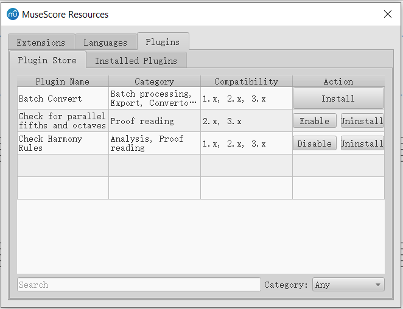

# Proposal of App Store-like Plugin Manager

By songchaow.

## Overview of Design

A new app-store like Plugin Manager is planned to be implemented. This tool can reside in Resource Manager(find it in MuseScore menu: Preferences->General->Update translations, or Help->Resource Manager) as a new tab, or just replace the old plugin manager.

In short, two main facilities are covered:

- (Part I) Automatically install and manage plugin packages from [MuseScore plugin repository](https://musescore.org/en/plugins).
- (Part II) Traditional facilities for local installed plugins(some of those plugins may be not published online).

> Here I refer to the stuff you download from the plugin repository as a "**plugin package**". 
>
> I want to stress the difference between a plugin package and a qml file, since **one** plugin package(such as [this one](https://musescore.org/project/add-and-remove-courtesy-accidentals)) may contain **multiple** qml files.
>
> In light of this, one qml plugin can have two meaningful names: the first is base name of the qml file(corresponding to one particular item in MuseScore Plugin's drop-down menu), and the second is the title from the web plugin page, i.e., the name of corresponding plugin package.

### Part I

Conceptual UI demo I made by merely modifying the UI file:

All available plugins from the online plugin repository will be displayed in this table. 

**Possible features:**

- you can search for new plugin packages and filter them by category labels.

- you can download new plugin packages and install them simply by clicking the "Install" button.

- For plugins that are incompatible for your MuseScore version(3.x), the manager should disable the install button normally.

  But maybe as an advanced mode, users can force the manager to download 2.x plugin packages and attempt to convert them to 3.x. (The converting method is described in "Implementation" part.)

- For downloaded plugin packages, you can enable, disable or delete them by clicking corresponding buttons.

  > These operation applies to all qmls that belong to the plugin package.
  >
  > In Part II, there are operations that apply to one single qml.

### Part II

Conceptual UI demo I made by merely modifying the UI file:

All installed plugins, at least for qmls that you manually added, will be displayed in the left QListWidget.

The text of each item in QListWidget is currently base name of the qml file.

**Possible features:**

- In addition to using Part I's facility, you can still manually download the qml file yourself or write your own plugin qmls locally, and copy them to plugin directory. Then they will appear after reloading.

- If local plugins are checked to be incompatible, necessary prompts can be added. 

  Maybe as an advanced mode, the manager can offer the attempt to convert 2.x plugins to 3.x ones. (The converting method is described in "Implementation" part)

- The traditional plugin manager's facilities will be reserved in this tab, including:

  - enabling/disabling each qml
  - shortcut configuration
  - displaying name, path, version and description. 

  These facilities are arranged as before in the right panel.

  <!--As to display of plugin name among these, I recommend **using name from title from plugin page(that's the name of plugin package)**, **rather than the base name of qml file**, as the base name is already shown in the left QListWidget. What's more, in this way we can tell difference between local plugins() and plugins from repository.-->

- For plugin packages installed from repository, there're several choices for displaying:

  - Just don't display them in this tab. Let users manage them completely in the first tab(Part I).

    Then facilities like shortcut configuration are lost.

  - One plugin package corresponds to one item in the left QListWidget.

  - Like local plugins, one plugin qml corresponds to one item in the left QListWidget.

  Personally I prefer the third choice, as it's flexible for users and relative simpler to implement than the second choice.

  But the second choice is also considerable if we implement a tree view, displaying all qmls of one package under that package item.

### Miscellaneous

- To make things consistent, Add "Check for new version of MuseScore plugins" in MuseScore->Preferences -> Update.

  And add corresponding facility of update reminder.

  

## Implementation

### Fetching from Web

When we launch the resource manager, the crawler should fetch a list of available plugin packages from `https://musescore.org/en/plugins?category=All&compatibility=some_version_id`.

The map between MuseScore version and`some_version_id` is:

| MuseScore Version | `some_version_id` |
| ----------------- | ----------------- |
| 1.x               | 4311              |
| 2.x               | 4316              |
| 3.x               | 4321              |

> It's not hard to parse the raw HTML table using some libraries, though the parsing code would be simpler if there were a JSON file.

Each entry of the plugin list should contain:

- Title(string)

  > The title here should use the title from the plugin page, i.e., the name of plugin package.

- API Compatibility(a tuple of `bool` indicating compatibilities for 3 versions)

- URL of the plugin page(string)

- Categories(`vector` of enum object)

### Download

Then when we click on `Install` button of any entry of plugin, the crawler will fetch the plugin page and extract structured data, including:

- GitHub repo URL(if applicable)
- Direct links that are recognized to be suitable plugin distributions
- Attachment URLs that are recognized to be suitable plugin distributions

> This fetch procedure can also be considered to run automagically in advance and store in cache, as the total number of plugins is not huge.

If GitHub repo URL is available, we should use [Github Release APIs](https://developer.github.com/v3/repos/releases) to check if there's a release. 

Else, look for direct links in the page or the attachments.

These steps would require sophisticated pattern recognizing algorithms to choose the correct version(2.x or 3.x, etc. ), which can be further discussed and optimized later.

### Extract and Install

There are various types of downloaded plugin files. Some are zips, and others are just qmls.

> There are [some code snippets](https://github.com/musescore/MuseScore/blob/1d5ae8afbb4b83b36558c1e365e8794d170d5065/mscore/resourceManager.cpp#L291) used for unzipping language packages, which can be used similarly for plugin packages.

After the zips are extracted, we should remove irrelevant files such as README and others, and copy all qml files and folders that contain them to the plugin directory.

Warnings should be reported if there are conflicts when copying files, such as qml files with the same name already exist.

### Maintaining the Local Plugin List

#### Permanent Storage

Not only the downloaded qmls are stored, some metadata about local plugins and plugin packages need to be stored.

Currently, MuseScore only stores metadata for local plugins in `plugins.xml`(located in C:\\[your username]\AppData\Local\MuseScore\MuseScore3). The xml file only stores the qml file path and flag of whether loaded for each local plugin. After MuseScore is launched, these items will be read into `QList<PluginDescription> _pluginList` in class `PluginManager`. (See [here](https://github.com/musescore/MuseScore/blob/a9df4a02c07cf5666644be620c6b951becedade8/mscore/plugin/pluginManager.cpp#L67))

Qml files of plugin packages should also be added into `plugins.xml`. 

But beyond that, for each plugin package downloaded from repository, additional metadata should be maintained:

- plugin package name or plugin page URL. These are helpful to identify installed plugin package from the plugin list fetched from repository. (We cannot tell it merely from installed qml files.)

- Paths of its qml files. This can be obtained after download/extracting the zip file. Those paths are useful when checking the integrity of local plugin packages and removing packages.

- Direct download link of plugin package if the package is downloaded from attachments. This field is used for checking updates.

- `Last modified` field of plugin package if applicable. This field is used for checking updates.

  HTTP responses of attachments from musescore.com have this field available in the header.

- Latest commit hash of GitHub repository if applicable. This field is used for checking updates.

These metadata can be saved in a separate xml file.

#### Runtime Data Structure

Currently MuseScore uses `QList<PluginDescription> PluginManager::_pluginList` to maintain local plugins. When MuseScore launches, it fills this QList with contents from `plugins.xml`, and loads and registers plugins that are marked to load.

For plugin packages, there ought to be a new `QList<PluginPackage>` to maintain installed plugin packages. `PluginPackage` will be a structure that contains metadata described in section *Permanent Storage*(package name/page URL,  paths of its qml files and timestamps).

This QList is also filled with contents from corresponding xml file. When the plugin manager is launched, integrities of each `PluginPackage` are checked by verifying existence of each qml file.

### Compatibility Check

Each plugin has its API compatibility specified in its web page. Plugins of compatibility 1.x, 2.x and 3.x can only be run on MuseScore 1.x, 2.x and 3.x respectively.

Compatibility check should happen in two cases:

- When installing plugins from repository, before the download begins, compatibility list specified in the plugin web page should be verified against current MuseScore version. If current MuseScore version is not in the list, download will be disabled.

- When importing/reloading local plugins, check whether the plugin is imported successfully.

  this can be done by analyzing the result of `QQmlComponent::create()`. See [example code](https://github.com/musescore/MuseScore/blob/1d5ae8afbb4b83b36558c1e365e8794d170d5065/mscore/plugin/mscorePlugins.cpp#L91), where the `errors()` method contains related info.

#### Try to Convert the 2.x Plugin

 Some of 2.x plugins can be converted to 3.x with some code changes, ~~this process cannot be done automagically yet~~. The plugin manager can try doing this job by applying the following two replacements in qml files:

- from `import MuseScore 1.0` to `import MuseScore 3.0`
- from `import FileIO 1.0` to `import FileIO 3.0`

The effect may be limited, but might works sometimes.

### Automatic Update

Most plugins don't have their own version numbers currently. ~~So how to detect updates of plugins seems to be a tough problem.~~ 

However, there're other ways to check if a particular plugin package has been changed:

- If the download URL has changed in the plugin page, it's reasonable to assume there's an update.

- For plugin files stored in musescore.com, the `Last Modified` field of HTTP Response header is available to check.

  When checking updates, we can send HTTP HEAD requests to those plugins' URLs, If newer `Last Modified` value is found in response, there's probably an update.

- For plugins stored in GitHub, the commit history can be checked via [Github Release APIs](https://developer.github.com/v3/repos/releases). If newer commit logs are found, there's probably an update.

Another stupid way is to download the whole plugin again and look for difference.
